

  
  
  # BlockChair
  ### Blockchain-Powered Charity Platform
  

> 🚧 **Note:** The website is currently hosted at [www.block-chair.tech](https://www.block-chair.tech). Some features may not be fully functional due to production environment limitations. We are actively working on improvements.

## 📘 Project Description

BlockChair is an innovative, blockchain-driven web platform that redefines trust, transparency, and engagement in the world of digital charity. Harnessing the power of Ethereum (ETH) and MetaMask integration, BlockChair enables secure, verifiable, and tamper-proof donations directly to charitable causes. Our mission is to create a transparent ecosystem where donors can witness the real-world impact of their contributions, while empowering charities to operate with increased credibility and efficiency.

At the heart of BlockChair is a smart contract-based milestone release system, which ensures that funds are only disbursed when predefined project goals are met. This eliminates misuse and enhances donor confidence.

With an emphasis on AI-driven safety, analytics, and personalization, BlockChair offers a suite of intelligent tools that improve user experience, vet charitable organizations, and optimize fundraising efforts.

## 🌟 Key Features

### 🔐 Blockchain-Based Donation System
- Secure integration with MetaMask wallet
- Donations made in Ethereum (ETH)
- Every transaction is recorded on a tamper-proof ledger for maximum transparency

  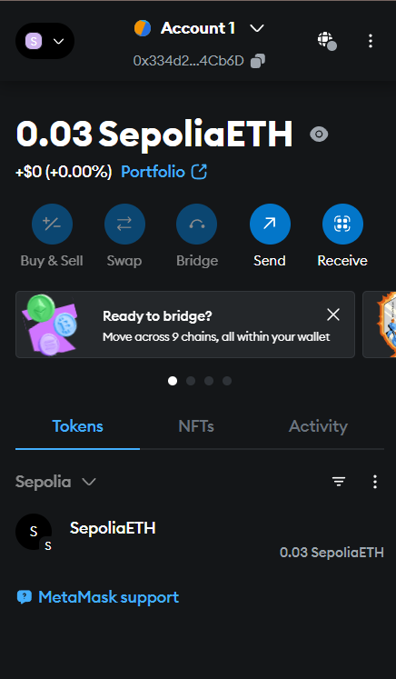

### 📑 Smart Contract Milestone Releases
- Donations are locked in smart contracts
- Funds are released in phases upon completion of predefined milestones
- Real-time updates and confirmation logs available for donors to track progress

  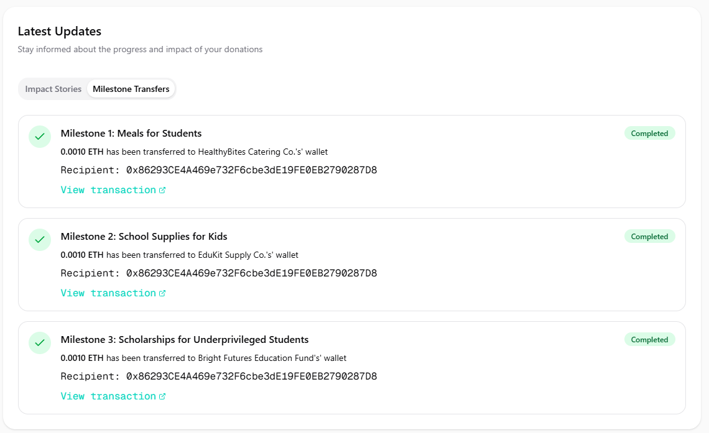

### 🤖 AI-Powered Trust & Personalization
- **AI Company Validator**: Verifies the legitimacy and operational history of charities

  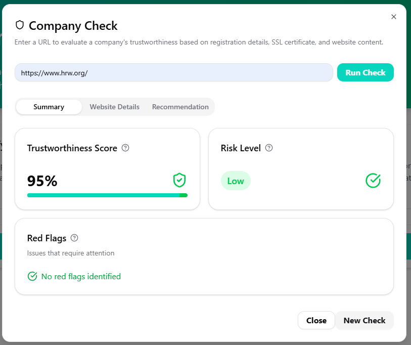
   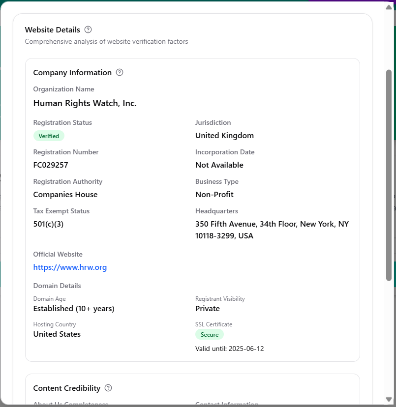
    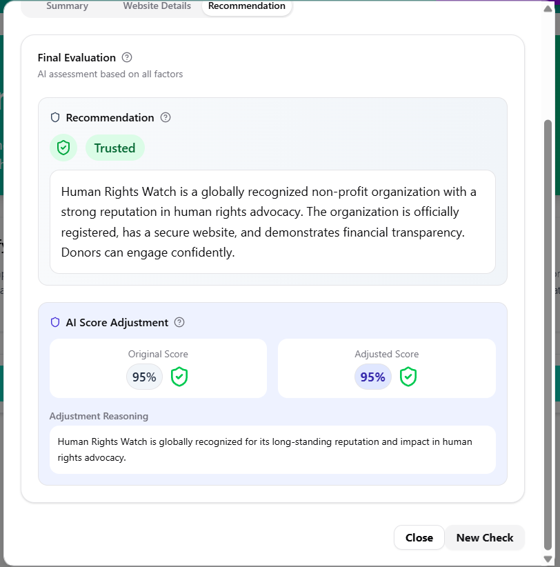

- **AI Wallet Analyzer**: Assesses recipient wallet activity and flags suspicious patterns

  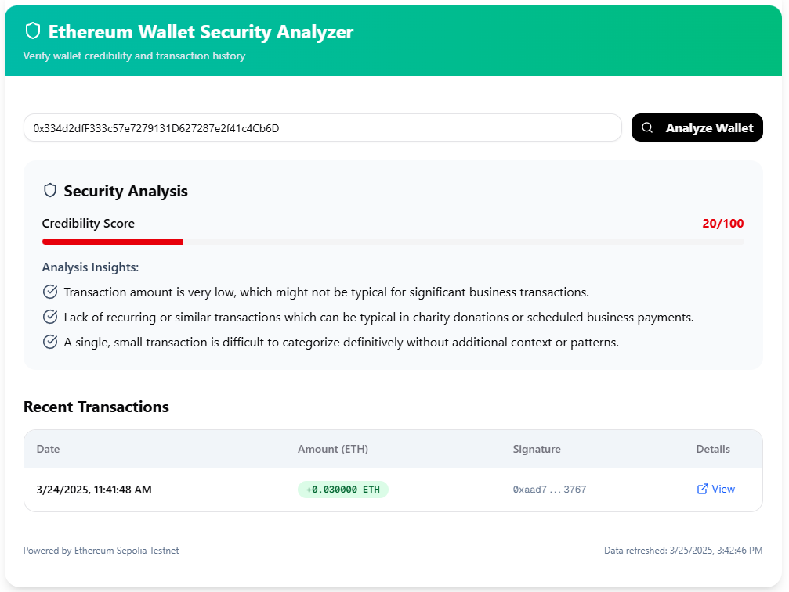

- **AI Fundraising Goal Advisor**: Recommends realistic fundraising targets for new charities based on similar historical data

  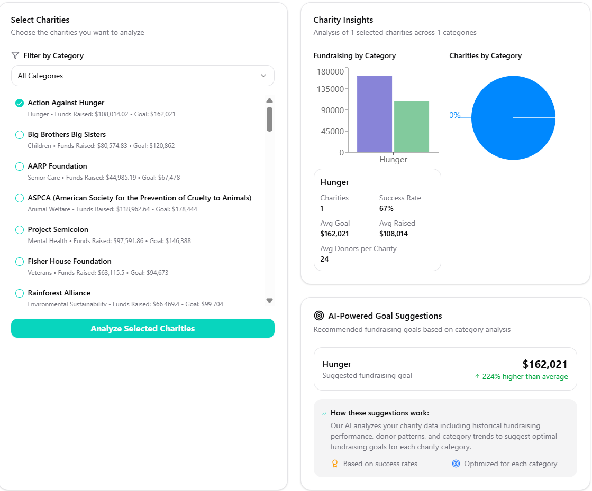

- **AI Donation Recommender**: Suggests personalized charity options to users based on interest, region, or cause

  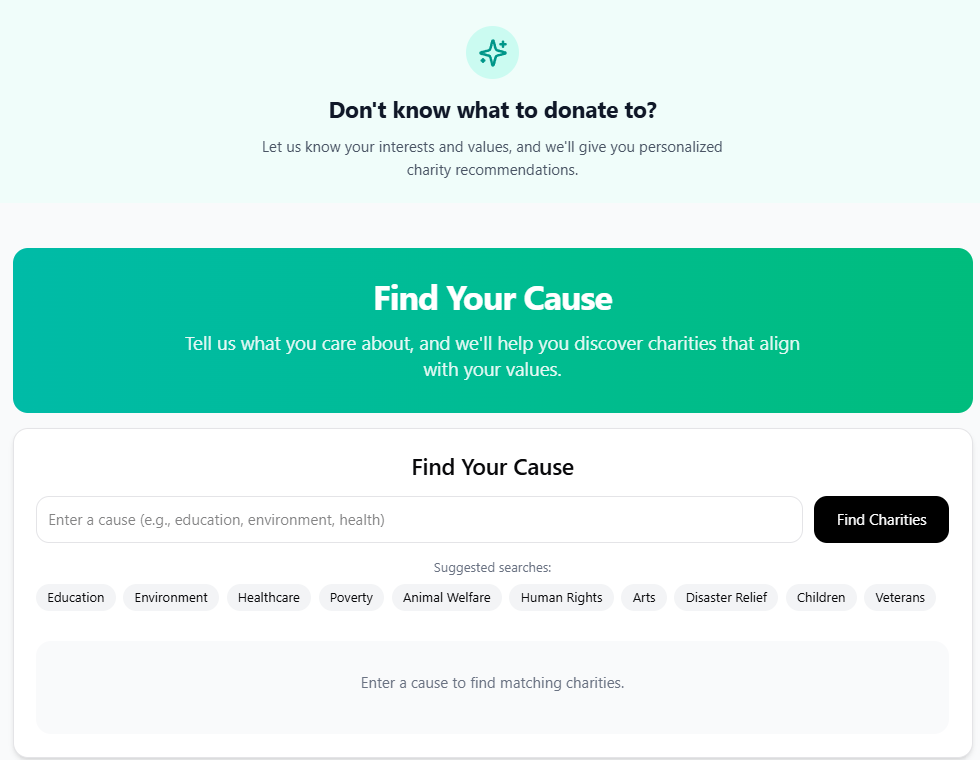

- **AI Chatbot Assistant**: Provides real-time help, donation tracking, and platform guidance

  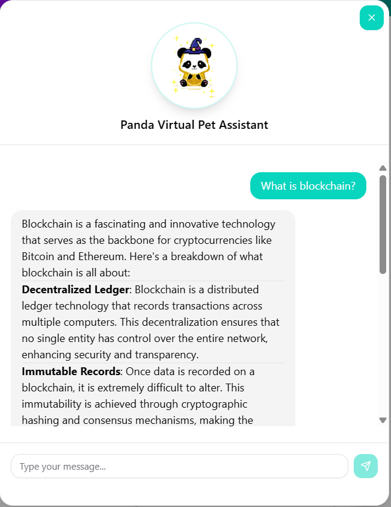

### 🐾 Gamification & Virtual Pet System
- Donors earn coins with every donation
- Coins can be used to customize virtual pets, enhancing user engagement
- Users can feed, decorate, and interact with their pets, encouraging return visits and ongoing contributions

  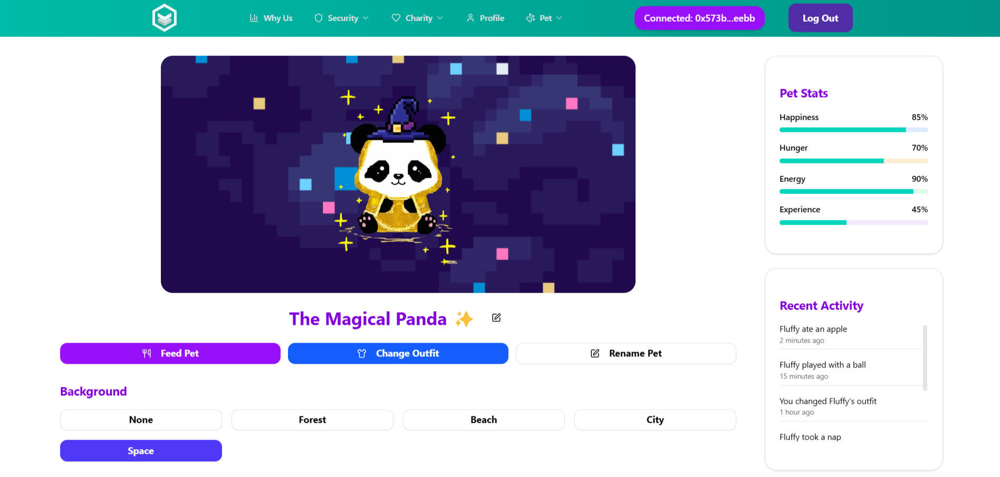

### 📰 Blockchain & Charity Literacy Hub
- Educational blog posts and articles on blockchain technology in the charity space
- Resources to help users understand the safety, transparency, and impact of crypto-based giving

  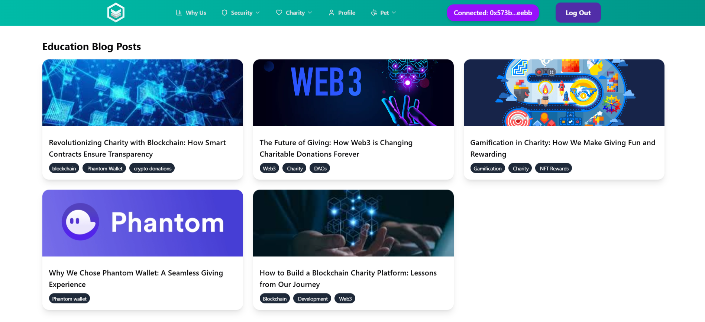

### 🛠️ End-to-End Transparency
- Donors can track their funds from contribution to final use
- Smart contracts can directly release funds to verified suppliers, bypassing intermediaries to prevent corruption or inefficiency
- Donors are notified when milestones are achieved

